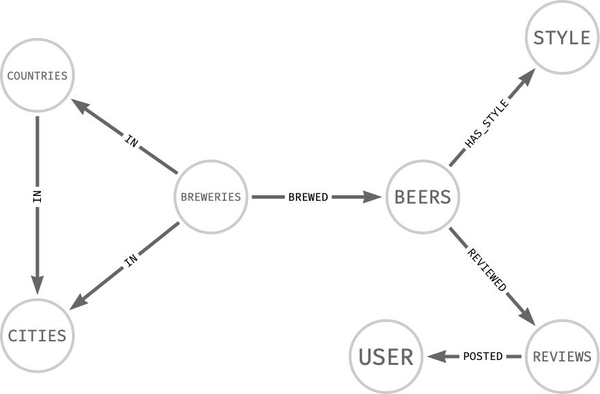

# 🍺 The Beer project  🍺


## Project Overview

The Beer project is an analysis of beer and breweries using a graph database. The data used in this project has been extracted from [kaggle](https://www.kaggle.com/ehallmar/beers-breweries-and-beer-reviews) and released by Evan Hallmark. While the author does not present metadata on the origin of the data, it is likely a collection of open data from places like [beeradvocate](https://www.beeradvocate.com/).

## Project Structure

````
.
├── data
├── Neo4Plugins
└── src
    └── queries.ipynb
├── requirements.txt
├── docker-compose.yml
├── README.md
````

- `data` - Contains the neo4j database used in the project.
- `Neo4jPlugins` - Contains the required Neo4j plugins jar files.
- `README.md` - This file contains the documentation and instructions for the project.
- `src` - Contains the source code for the project, including the queries in the queries.ipynb Jupyter notebook.
- `requirements.txt` - Lists the required Python packages and their versions for the project.
- `docker-compose.yml` - Defines the Docker Compose environment for the project, including the Neo4j server and any other necessary services.

## Getting Started

To run this project, you'll need to have Docker installed on your local machine. If you're not familiar with Docker or don't have it installed, please visit [the official website](https://www.docker.com) to learn more and follow the installation instructions for your platform:

[Docker for Mac](https://docs.docker.com/desktop/install/mac-install/)  
[Docker for Linux](https://docs.docker.com/desktop/get-started/)  
[Docker for Windows](https://docs.docker.com/desktop/install/windows-install/)

This application is shipped with a Docker Compose environment that contains the necessary containers for running the application. The following steps will guide you through setting up the environment:

- Download the data required for the project and extract it to the data folder.
- Download the compatible version of the neo4j-graph-data-science plugin and add it to the Neo4JPlugin folder.
- Run the docker-compose.yml file using the following command to create a container for the Neo4j server and related services.
```docker
docker-compose up
```
Once the containers are up and running, you should be able to access the application at http://localhost:7474/.

## Schema




### Nodes

- `Countries`
    - name: Name of the country.
- `Cities`
    - `name`: Name of the city.
- `Breweries`
  - id: Unique identifier of the brewery.
  - name: Name of the brewery.
  - state: State where the brewery is located.
  - notes: Notes about the brewery.
  - types: Types of beer brewed by the brewery.
- `Beers`
  - id: Unique identifier of the beer.
  - name: Name of the beer.
  - abv: Alcohol by volume (ABV) of the beer.
  - state: State where the beer is produced.
  - notes: Notes about the beer.
  - retired: Whether the beer has been retired.
  - availability: Availability of the beer.
  - brewery_id: ID of the brewery that produced the beer.
- `Reviews`
  - id: Unique identifier of the review.
  - text: Text of the review.
  - smell: Score of the smell of the beer in the review.
  - look: Score of the look of the beer in the review.
  - taste: Score of the taste of the beer in the review.
  - feel: Score of the feel of the beer in the review.
  - overall: Overall score of the beer in the review.
  - score: Score of the beer in the review.
  - date: Date of the review.
  - beer_id: ID of the beer that is being reviewed.
- `Style`
  - name: Name of the beer style.
- `User`
  - name: Name of the user.

### Relationships

- `IN`
    - BREWERIES: located IN COUNTRIES.
    - BREWERIES: located IN COUNTRIES.
    - CITIES: located IN COUNTRIES.
- `BREWED`
    - BEERS: BREWED by BREWERIES. 
- `HAS_STYLE`
  - BEERS: HAS STYLE.
- `REVIEWED`
  - BEERS: has REVIEWS.
- `POSTED`
  - REVIEWS: POSTED by USER.

    
```docker
(BREWERIES)-[:IN]->()<-[:IN]-()<-[:IN]-(BREWERIES)-[:BREWED]->(BEERS)-[:HAS_STYLE]->(),
(BEERS)-[:REVIEWED]->()-[:POSTED]->()
```